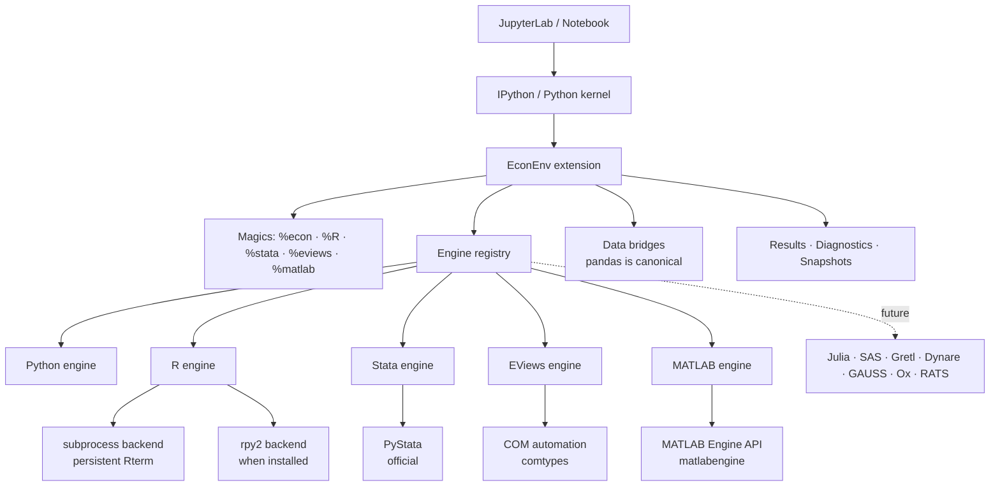

<div align="center">

# EconEnv

**One Notebook. Multiple Econometric Engines.**

Python, R, Stata, EViews and MATLAB in a single Jupyter workflow — on one Python kernel.

[](https://merwanroudane.github.io/econenv/)
[](https://pypi.org/project/econenv/)
[](https://pypi.org/project/econenv/)
[](https://github.com/merwanroudane/econenv/blob/main/LICENSE)
[](#project-status)
[](https://colab.research.google.com/github/merwanroudane/econenv/blob/main/examples/11_colab_quickstart.ipynb)

**[Website](https://merwanroudane.github.io/econenv/)** · **[Install from PyPI](https://pypi.org/project/econenv/)** · [User Guide (PDF)](https://github.com/merwanroudane/econenv/blob/main/docs/guide/econenv-guide.pdf) · [Examples](https://github.com/merwanroudane/econenv/tree/main/examples/) · [Changelog](https://github.com/merwanroudane/econenv/blob/main/CHANGELOG.md)

</div>

---

## The problem

An applied econometrics paper rarely lives in one program. The unit-root test is
in EViews because that is where the ARDL bounds output is readable. The panel
estimator is in Stata because `xtreg` is the reference implementation. The plots
are in R because `ggplot2` is better. The data cleaning is in Python because
pandas is better.

So the working day looks like this:

```
Python → to_csv() → Stata → export → R → write.csv → EViews → MATLAB
```

Five programs open. Five windows. Five copies of the same data, drifting apart.
A missing value that meant `.a` in Stata arriving as an empty cell in R. A
quarterly index that became a string. And when a referee asks "why does your
robust standard error differ from mine?", there is no way to answer without
redoing the whole chain by hand.

## The solution

EconEnv makes the five programs **execution engines behind one Python kernel**.

```python
%load_ext econenv

df = pd.read_csv("data.csv")          # Python, as usual
```

```python
%%R -i df
fit <- lm(y ~ x1 + x2, data = df)
summary(fit)
```

```python
%%stata
regress y x1 x2
```

```python
%%eviews -i df
equation eq1.ls y c x1 x2
```

Never typed an EViews command before? You do not have to leave the notebook to
find one:

```python
%econ eviews find cointegration
```

One notebook. One kernel. One dataset. No CSV round-trip.

And then the part that is hard to do any other way:

```python
econenv.compare_ols(df, "y ~ x1 + x2")
```

```
OLS: y ~ x1 + x2
Engines agree within tolerance (rtol=1e-08, atol=1e-10)

Coefficients
          python           r       stata      eviews
term
x1     0.4821094   0.4821094   0.4821094   0.4821094
x2    -0.1330277  -0.1330277  -0.1330277  -0.1330277
_cons  1.9042118   1.9042118   1.9042118   1.9042118

Notes:
  - aic: AIC normalisation differs: statsmodels -2ll+2k; R counts sigma^2 as a
    parameter (k+1); EViews divides by n; Stata needs `estat ic`.
```

The coefficients match. The information criteria do not — and EconEnv says
**why**, instead of quietly picking one.

---

## Architecture



Three rules hold the design together:

1. **No custom kernel.** EconEnv is a Python package plus an IPython extension.
   A polyglot kernel is evaluated in the roadmap, not assumed.
2. **Nothing above the engine layer touches a vendor API.** Magics, the CLI,
   diagnostics and the model layer speak only to `BaseEngine`. MATLAB was added
   as one adapter without touching the core, which is the test of that claim.
3. **Never hide a difference.** Lossy conversions warn. Engine disagreements are
   reported with the defaults that explain them.

---

## Features

| | |
|---|---|
| **Five engines, one kernel** | Python, R, Stata, EViews, MATLAB — persistent sessions, no kernel switching |
| **Real data bridge** | `pandas.DataFrame` is canonical; push/pull/move between any two engines with no file round-trip |
| **Type fidelity** | Factors, categoricals, dates, booleans, integers and missing values survive the trip — or you get a warning saying exactly what changed |
| **Econometric metadata** | Time variable, panel variable, frequency, labels and conversion history travel with the frame |
| **Structured results** | `ExecutionResult` and `ModelResult` instead of scraped text; raw engine output always retained |
| **Cross-engine comparison** | Same specification, five engines, one table, with tolerance-aware agreement testing |
| **Diagnostics** | `econenv doctor` checks every layer and tells you how to fix what is broken |
| **Reproducibility** | Environment snapshots and provenance records (code hash, data hash, versions, timing) |
| **Rich output** | HTML tables, and plots from R, EViews and MATLAB rendered inline |
| **Publication export** | Tables to LaTeX, Word, Excel, HTML, Markdown and RTF; journal layout with significance stars, or every statistic |
| **Honest about limits** | Capability matrix reports what each engine can do *on this machine*, not in theory |

---

## Installation

Released on PyPI: **<https://pypi.org/project/econenv/>**

```bash
pip install econenv
```

On an older release? Upgrade — EViews cell output and graph capture were broken
in 0.1.0, and EViews version reporting in 0.1.0 and 0.1.1.

```bash
pip install --upgrade econenv
```

Optional extras — install only what you use:

```bash
pip install "econenv[stata]"    # helper for locating PyStata
pip install "econenv[eviews]"   # comtypes, Windows only
pip install "econenv[arrow]"    # fast Arrow transfer to R
pip install "econenv[export]"   # Word and Excel export
pip install "econenv[all]"
```

Then, in a notebook:

```python
%load_ext econenv
%econ doctor
```

### Requirements

| | Required | Notes |
|---|---|---|
| Python | 3.9+ | the host kernel |
| pandas, numpy, IPython, statsmodels | yes | installed automatically |
| R | optional | 4.0+; EconEnv finds it, no PATH setup needed |
| Stata | optional | **17 or newer** — PyStata ships with Stata 17+ |
| EViews | optional | **Windows only**; automation is COM-based |
| `comtypes` | for EViews | `pip install "econenv[eviews]"` |
| MATLAB | optional | needs `matlabengine` pinned to **both** the release and your Python — R2024a is `24.1.*` (Python ≤3.11), R2026a is `26.1.*` (first to accept 3.13). `econenv doctor` prints the exact pin. |
| `rpy2` | never required | no Windows wheels; EconEnv's subprocess backend replaces it |

### Google Colab

[](https://colab.research.google.com/github/merwanroudane/econenv/blob/main/examples/11_colab_quickstart.ipynb)

One line to install, no local setup.

| Engine | On Colab | |
|---|---|---|
| Python | works | it is the kernel |
| R | works | R is on the Colab image |
| Stata | **possible** | Stata for Linux + a Linux licence, installed from Drive each session |
| EViews | no | no Linux build; Wine fails licence activation; and EViews forbids remote access — *"web server access to EViews via COM is not allowed"* |
| MATLAB | **possible** | MATLAB for Linux exists; same licence question as Stata |

**Want all five engines with the Colab interface?** Use Colab's *local runtime*:
the notebook UI stays Colab, but the kernel runs on your own PC, so EViews and
Stata work exactly as they do locally. Nothing is exposed to the internet — your
browser talks to `localhost`. It needs the classic Jupyter stack
(`notebook==6.4.12`), because the bridge package does not load on notebook 7.

`%econ doctor` detects Colab and says which of these applies to you.
[Full details, including both recipes](https://github.com/merwanroudane/econenv/blob/main/docs/installation.md#google-colab).


---

## Engine setup

EconEnv discovers installations automatically — environment variables, `PATH`,
the Windows registry, then the usual install roots. You should not need to
configure anything. When you do:

```python
%econ config r.home      "C:/Program Files/R/R-4.5.2"
%econ config stata.home  "C:/Program Files/Stata19"
%econ config stata.edition mp
%econ config eviews.progid EViews.Manager.14
```

Or persistently, in `~/.econenv/config.toml`:

```toml
[r]
home = "C:/Program Files/R/R-4.5.2"

[stata]
home = "C:/Program Files/StataNow19"
edition = "mp"

[eviews]
progid = "EViews.Manager.14"
```

Environment variables work too: `ECONENV_STATA_EDITION=mp`, `R_HOME`,
`STATA_HOME`.

**A note on R and Windows.** rpy2 publishes no Windows wheels, so EconEnv's
default R backend is a persistent `Rterm` child process driven over a private
protocol — no compiler, no `R_HOME` gymnastics. Where rpy2 *is* installed
(usually Linux and macOS) EconEnv uses it, and loads **rpy2's own** `%R`/`%%R`
magics rather than shadowing them.

---

## Examples

### Move data without touching a file

```python
econenv.push("stata", "default", df)      # Python  → Stata
econenv.move("stata", "r", "default")     # Stata   → R
back = econenv.pull("r", "econenv_ols_data")
```

### Keep the metadata

```python
%%R -i panel -o results
library(plm)
fit <- plm(y ~ x, data = panel, index = c("id", "year"), model = "within")
results <- as.data.frame(summary(fit)$coefficients)
```

`panel`'s MultiIndex is recognised as (entity, time); `results` comes back with
its R types intact.

### See what a transfer cost

```python
econenv.push("eviews", "wf", df)
```

```
UserWarning: EconEnv push -> eviews: [warning] region: categorical stored as
integer codes; EViews has no factor type
```

### Diagnose

```bash
econenv doctor
```

```
✔ PASS    Python: 3.11.0
✔ PASS    R installation: C:\Program Files\R\R-4.5.2 (R 4.5.2)
! WARNING Multiple R versions: 4.5.2, 4.4.3
              → EconEnv picks the newest. Pin one with `%econ config r.home ...`.
✔ PASS    PyStata: C:\Program Files\StataNow19\utilities\pystata
! WARNING COM version binding: several EViews versions are installed
              → Pin one: `%econ config eviews.progid EViews.Manager.14`.
```

More in [`examples/`](https://github.com/merwanroudane/econenv/tree/main/examples/):

1. Quick start
2. Python + R
3. Python + Stata
4. Python + EViews
5. All engines together
6. The same OLS across engines
7. Data transfer and type fidelity
8. Time series
9. Panel data

---

## Project status

**v1.0 — stable, released on [PyPI](https://pypi.org/project/econenv/).**
Execution, engine management, the data bridge, results,
graphs, diagnostics, snapshots and cross-engine OLS comparison are implemented
and tested. The public API — the magics, `push`/`pull`/`move`, the result
objects and `compare_ols` — is stable and follows semantic versioning: no
breaking change without a major bump.

### Releases

| Version | | What changed |
|---|---|---|
| **1.1.1** | [PyPI](https://pypi.org/project/econenv/1.1.1/) · [notes](https://github.com/merwanroudane/econenv/blob/main/CHANGELOG.md#111--2026-09-05) | MATLAB R2026a and Python 3.13; five-engine docs |
| 1.0.9 | [PyPI](https://pypi.org/project/econenv/1.0.9/) · [notes](https://github.com/merwanroudane/econenv/blob/main/CHANGELOG.md#109--2026-09-05) | Working links on the PyPI page |
| 1.0.8 | [PyPI](https://pypi.org/project/econenv/1.0.8/) · [notes](https://github.com/merwanroudane/econenv/blob/main/CHANGELOG.md#108--2026-09-05) | MATLAB as a fifth engine; publication export; broadcast |
| 1.0.7 | [PyPI](https://pypi.org/project/econenv/1.0.7/) · [notes](https://github.com/merwanroudane/econenv/blob/main/CHANGELOG.md#107--2026-09-04) | First stable release; API declared stable |
| 0.1.7 | [PyPI](https://pypi.org/project/econenv/0.1.7/) · [notes](https://github.com/merwanroudane/econenv/blob/main/CHANGELOG.md#017--2026-09-04) | Google Colab support; all four engines via a local runtime |
| 0.1.6 | [PyPI](https://pypi.org/project/econenv/0.1.6/) · [notes](https://github.com/merwanroudane/econenv/blob/main/CHANGELOG.md#016--2026-09-04) | EViews command reference searchable from a cell; forecast plots; worked example on real data; user guide |
| 0.1.5 | [PyPI](https://pypi.org/project/econenv/0.1.5/) · [notes](https://github.com/merwanroudane/econenv/blob/main/CHANGELOG.md#015--2026-09-04) | Full EViews graph/output audit; text and spool views captured; no silent failures |
| 0.1.4 | folded into 0.1.5 · [notes](https://github.com/merwanroudane/econenv/blob/main/CHANGELOG.md#014--2026-09-04) | EViews graph commands (`line x`) now render |
| 0.1.3 | [PyPI](https://pypi.org/project/econenv/0.1.3/) · [notes](https://github.com/merwanroudane/econenv/blob/main/CHANGELOG.md#013--2026-09-04) | EViews plotting views (`x.line`) now render; no duplicate or repeated figures |
| 0.1.2 | [PyPI](https://pypi.org/project/econenv/0.1.2/) · [notes](https://github.com/merwanroudane/econenv/blob/main/CHANGELOG.md#012--2026-09-04) | Correct EViews ProgID discovery; stop guessing the EViews version before connecting |
| 0.1.1 | [PyPI](https://pypi.org/project/econenv/0.1.1/) · [notes](https://github.com/merwanroudane/econenv/blob/main/CHANGELOG.md#011--2026-09-04) | EViews cell output and graph capture; honest engine reporting |
| 0.1.0 | [PyPI](https://pypi.org/project/econenv/0.1.0/) · [notes](https://github.com/merwanroudane/econenv/blob/main/CHANGELOG.md#010--2026-09-04) | First release |

Install the latest with `pip install --upgrade econenv`.

What is verified, and on what:

| | Verified |
|---|---|
| Python engine | yes, in CI |
| R engine (subprocess) | yes, against R 4.5.2 on Windows |
| Stata engine | yes, against StataNow 19.5 MP + PyStata 0.1.2 |
| EViews engine | yes, against EViews 13 via COM on Windows |
| R engine (rpy2) | **not** verified — no rpy2 on the development machine |
| Linux / macOS | **not** verified — the design supports them; nobody has run them yet |

Where something is untested, this README and the docs say so. See
[`docs/audit/PHASE0_TECHNOLOGY_AUDIT.md`](https://github.com/merwanroudane/econenv/blob/main/docs/audit/PHASE0_TECHNOLOGY_AUDIT.md)
for the measured evidence behind every technical decision.

## Roadmap

| Version | Scope |
|---|---|
| **v0.1** | Execution + engine management + data bridge + results + graphs + diagnostics ✅ |
| v0.2 | Broader type coverage, Stata value labels, EViews alpha/matrix transfer, Arrow everywhere |
| v0.3 | Model registry beyond OLS: logit, probit, IV, panel FE/RE |
| v0.4 | Time-series and cointegration estimators; richer comparison reports |
| v0.5 | Full provenance capture and run manifests |
| v1.0 | Stable public API, documented multi-engine workflow, JupyterLab cell-toolbar extension |

Graphs were pulled forward from v0.3 into v0.1: plot capture is a property of the
transport layer, and retrofitting it later would have meant touching every
adapter twice.

---

## Platform support

| | Python | R | Stata | EViews |
|---|---|---|---|---|
| **Windows** | ✅ | ✅ | ✅ | ✅ |
| **Linux** | ✅ | ✅ | ✅ | ✖ COM is unavailable |
| **macOS** | ✅ | ✅ | ✅ | ✖ COM is unavailable |

The absence of EViews never blocks installation or use of the others. On
non-Windows platforms the EViews engine reports itself unavailable and everything
else works normally.

---

## Commercial software disclaimer

**EconEnv contains, bundles and redistributes no part of Stata or EViews** — no
binaries, no libraries, no licence files, no serial numbers, no activation keys.

EconEnv locates software already installed on your machine and drives it through
each vendor's own documented automation interface. You are responsible for
obtaining, installing and licensing Stata and EViews, and for complying with
those licences, including any restriction on concurrent sessions, server
deployment or automated use.

Stata® is a registered trademark of StataCorp LLC. EViews® is a registered
trademark of IHS Global Inc. R is free software from the R Foundation. None of
them endorses or is affiliated with this project.

---

## Troubleshooting

Start with `econenv doctor` — it names the problem and the fix. Common ones are
in [`docs/troubleshooting.md`](https://github.com/merwanroudane/econenv/blob/main/docs/troubleshooting.md), including:

* Stata says the edition is wrong
* EViews connects to the wrong version
* R starts but never becomes ready
* `pyeviews` fails to import (it is not needed)
* Values arrive in EViews as all-NA

## Contributing

Issues and pull requests are welcome. See
[`docs/development.md`](https://github.com/merwanroudane/econenv/blob/main/docs/development.md) for the layout, the test markers
(`-m "not stata and not eviews"` runs everything that needs no licence) and how
to write a new engine adapter.

## Citation

If EconEnv is part of your research workflow, please cite it — see
[`CITATION.cff`](https://github.com/merwanroudane/econenv/blob/main/CITATION.cff).

## License

MIT — see [LICENSE](https://github.com/merwanroudane/econenv/blob/main/LICENSE). The MIT grant covers EconEnv's own source only and
confers no rights in Stata, EViews or R.

## Author

**Dr Merwan Roudane** · [github.com/merwanroudane](https://github.com/merwanroudane)
